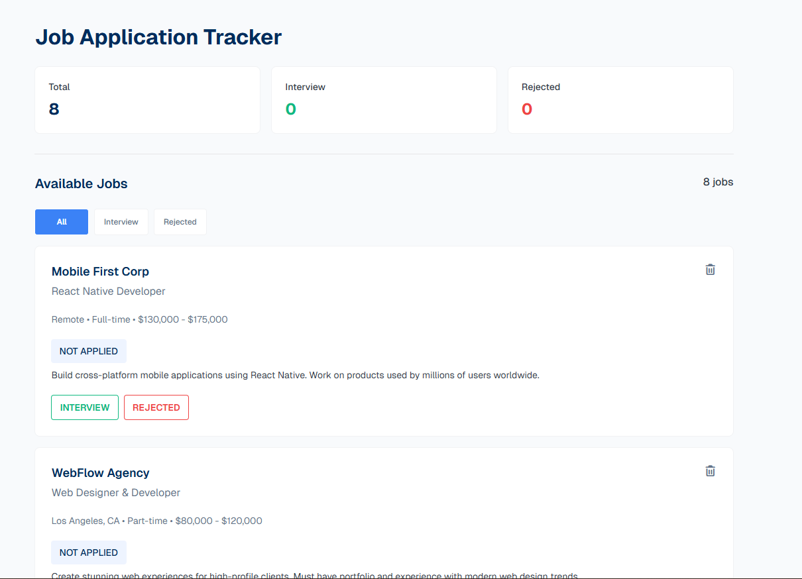
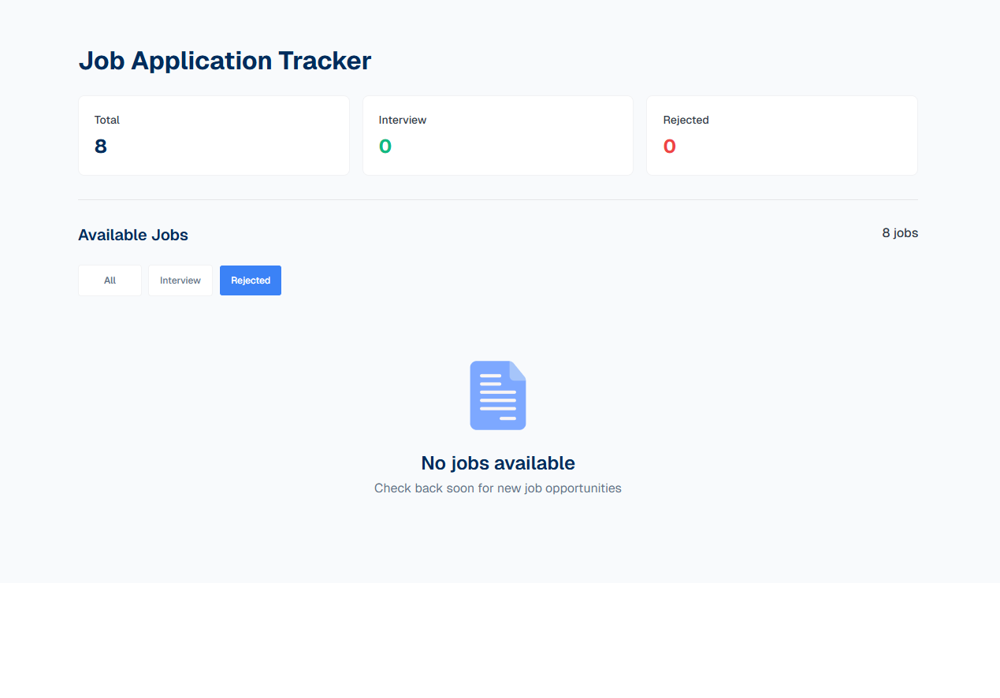

# 📋 Job Application Tracker

A clean, responsive **Job Application Tracker** web app that helps job seekers manage and monitor their job applications in one place. Users can track application statuses — marking jobs as **Interview** or **Rejected** — and get a real-time summary dashboard of their progress.

---



## 🌐 Live Link

🔗 [View Live Project](https://rashedulislam595.github.io/Assignment-4-Job-Tracker/)

📁 [GitHub Repository](https://github.com/rashedulislam595/Assignment-4-Job-Tracker?tab=readme-ov-file)

---

## 🛠️ Main Technology Used

- **HTML5** — Markup and page structure
- **CSS3** — Styling and responsive layout
- **TailwindCSs** — Utility-first CSS framework for styling and responsive layouts 
- **JavaScript (Vanilla JS)** — Application logic, DOM manipulation, and interactivity

---

## ✨ Main Features

- 📊 **Dashboard Summary** — Displays real-time counts of Total, Interview, and Rejected applications
- 🗂️ **Tabbed Filtering** — Switch between All, Interview, and Rejected tabs to filter job cards
- ✅ **Interview / Rejected Actions** — Mark any job as Interview or Rejected with a single click
- 🗑️ **Delete Jobs** — Remove a job card from the UI; counts update instantly
- 📱 **Responsive Design** — Mobile-friendly layout that works across all screen sizes
- 🔄 **Dynamic Counter Updates** — Dashboard stats update in real time as statuses change


---

## 🚀 How to Run Locally

Follow these steps to run the project on your local machine:

### 1. Clone the Repository

```bash
git clone https://github.com/rashedulislam595/Assignment-4-Job-Tracker.git
```

### 2. Navigate into the Project Folder

```bash
cd Assignment-4-Job-Tracker
```

### 3. Open in Browser

Since this is a pure HTML/CSS/JS project, simply open the `index.html` file in your browser:

- **Option A:** Double-click the `index.html` file in your file explorer
- **Option B:** Right-click `index.html` → *Open with* → your preferred browser
- **Option C:** Use the VS Code **Live Server** extension for a better dev experience:
  1. Install [Live Server](https://marketplace.visualstudio.com/items?itemName=ritwickdey.LiveServer) in VS Code
  2. Right-click `index.html` → **Open with Live Server**

> ✅ No installation, no terminal commands, no build steps needed!

---

## 📁 Project Structure

```
Assignment-4-Job-Tracker/
├── index.html       # Main HTML file
├── style.css        # Stylesheet
└── script.js        # JavaScript logic
```

---

## 👤 Author

**Rashedul Islam**
- GitHub: [@rashedulislam595](https://github.com/rashedulislam595)